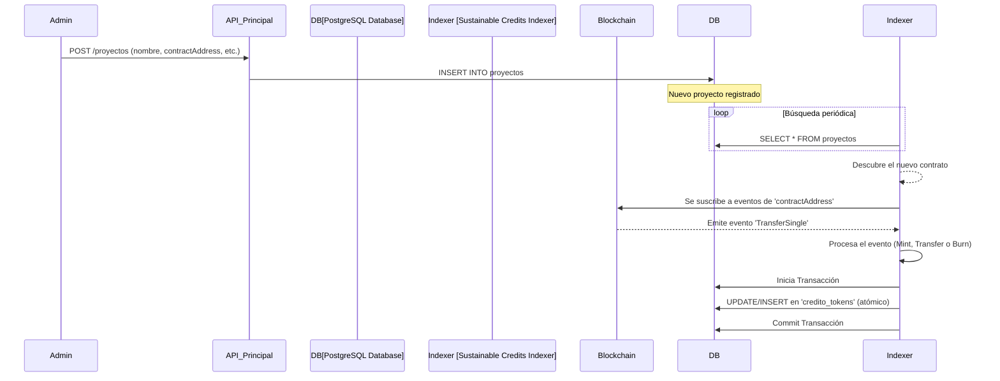

# Sustainable Credits Indexer


Servicio de indexación off-chain para eventos de contratos inteligentes ERC-1155 de créditos de sostenibilidad.

---

## 1. Resumen del Proyecto

El **Sustainable Credits Indexer** es un servicio backend robusto y escalable construido con **NestJS**. Su propósito fundamental es actuar como un puente de datos eficiente entre la blockchain y nuestra plataforma de aplicación.

El servicio escucha activamente los eventos de contratos inteligentes (estándar ERC-1155) que representan **Activos del Mundo Real (RWA)**, como créditos de carbono, biodiversidad o reciclaje. Procesa estos eventos en tiempo real y los persiste en una base de datos relacional (PostgreSQL), creando una fuente de datos rápida, fiable y consultable.

Esto elimina la necesidad de que las aplicaciones cliente interactúen directamente con la blockchain para consultas de estado (ej. saldos de tokens), lo cual sería lento, costoso e ineficiente.

## 2. Arquitectura y Flujo de Datos

El sistema está diseñado para ser desacoplado y auto-configurable, siguiendo un flujo de trabajo claro y eficiente.



### Componentes Clave:

- **NestJS:** Framework progresivo de Node.js para construir aplicaciones backend eficientes y escalables.
- **TypeORM:** Un ORM para TypeScript que permite una interacción fluida y segura con la base de datos.
- **PostgreSQL:** Base de datos relacional robusta para almacenar el estado indexado.
- **Ethers.js:** Librería para interactuar con la blockchain Ethereum (o redes compatibles como Polygon), permitiendo la conexión a nodos RPC y la decodificación de eventos.

## 3. Características Principales

- **Indexación en Tiempo Real:** Utiliza WebSockets para conectarse a un nodo RPC y escuchar eventos de contratos tan pronto como se emiten.
- **Configuración Dinámica:** El servicio consulta periódicamente la base de datos para descubrir nuevos contratos de proyectos. Esto permite añadir soporte a nuevos proyectos sin necesidad de reiniciar o redesplegar el indexador.
- **Operaciones Atómicas:** Todas las actualizaciones en la base de datos que involucran múltiples registros (como una transferencia de tokens) se envuelven en **transacciones de base de datos**. Esto garantiza la integridad de los datos: o todas las operaciones se completan con éxito, o ninguna lo hace.
- **Manejo Integral de ERC-1155:** Interpreta correctamente el evento `TransferSingle` para diferenciar entre:
  - **Acuñación (Mint):** `from` es la dirección cero.
  - **Transferencia (Transfer):** `from` y `to` son billeteras válidas.
  - **Quema (Burn):** `to` es la dirección cero.
- **Resiliencia:** Diseñado para manejar la lógica de negocio de forma segura, validando saldos antes de realizar débitos y registrando errores de forma detallada.

## 4. Primeros Pasos

### Prerrequisitos

- Node.js (v18 o superior)
- npm o yarn
- PostgreSQL (se recomienda ejecutarlo con Docker)
- Una URL de un nodo RPC (ej. de Alchemy, Infura o un nodo propio) para la red blockchain a monitorear.

### Instalación

1.  **Clonar el repositorio:**

    ```bash
    git clone https://github.com/ecolab-web3/latin-hack-project
    cd sustainable-credits-indexer
    ```

2.  **Instalar dependencias:**

    ```bash
    npm install
    ```

3.  **Configurar variables de entorno:**
    Crea un archivo `.env` en la raíz del proyecto a partir del ejemplo.

    ```bash
    cp .env.example .env
    ```

    Luego, edita el archivo `.env` con tus propias credenciales y endpoints.

4.  **Iniciar la base de datos:**
    Si usas Docker, puedes iniciar una instancia de PostgreSQL con:

    ```bash
    docker run --name some-postgres -e POSTGRES_PASSWORD=mysecretpassword -e POSTGRES_USER=user -e POSTGRES_DB=sustainable_credits -p 5432:5432 -d postgres
    ```

5.  **Ejecutar la aplicación:**
    El servicio se iniciará, se conectará a la base de datos, buscará proyectos y comenzará a escuchar eventos.
    ```bash
    npm run start:dev
    ```

## 5. API Endpoints

El indexador expone una API RESTful para consultar los datos procesados de manera eficiente.

### Consultar Tokens por Billetera

Este endpoint demuestra la eficiencia de tener los datos indexados, permitiendo consultas instantáneas sin interactuar con la blockchain.

- **Endpoint:** `GET /proyectos/wallet/:address`
- **Descripción:** Devuelve una lista de todos los créditos tokenizados (y sus cantidades) que pertenecen a una dirección de billetera específica. Incluye la información detallada del proyecto al que pertenece cada crédito.
- **Parámetros:**
  - `address` (string): La dirección de la billetera (ej. `0x...`).
- **Respuesta Exitosa (200 OK):**

```json
[
  {
    "id": 1,
    "tokenId": 101,
    "ownerWallet": "0x1234...abcd",
    "cantidad": "50.00",
    "createdAt": "2023-10-27T10:00:00.000Z",
    "updatedAt": "2023-10-27T10:00:00.000Z",
    "proyecto": {
      "id": "a1b2c3d4-...",
      "nombre": "Proyecto de Reforestación Amazónica",
      "tipoCredito": "CARBONO",
      "contractAddress": "0xABCD...1234",
      "ipfsHashDocumentos": "Qm..."
    }
  }
]
```

## 6. Variables de Entorno

El archivo `.env` debe contener las siguientes variables para que el servicio funcione correctamente:

```dotenv
# Configuración de la Base de Datos
DB_HOST=localhost
DB_PORT=5432
DB_USERNAME=user
DB_PASSWORD=mysecretpassword
DB_DATABASE=sustainable_credits

# Configuración de la Blockchain
JSON_RPC_URL="https://polygon-mumbai.g.alchemy.com/v2/YOUR_ALCHEMY_KEY"

# ABI del Contrato ERC-1155
# Debe ser una cadena JSON minificada en una sola línea.
CONTRACT_ABI='[{"anonymous":false,"inputs":[{"indexed":true,"internalType":"address","name":"operator","type":"address"},{"indexed":true,"internalType":"address","name":"from","type":"address"},{"indexed":true,"internalType":"address","name":"to","type":"address"},{"indexed":false,"internalType":"uint256[]","name":"ids","type":"uint256[]"},{"indexed":false,"internalType":"uint256[]","name":"values","type":"uint256[]"}],"name":"TransferBatch","type":"event"},{"anonymous":false,"inputs":[{"indexed":true,"internalType":"address","name":"operator","type":"address"},{"indexed":true,"internalType":"address","name":"from","type":"address"},{"indexed":true,"internalType":"address","name":"to","type":"address"},{"indexed":false,"internalType":"uint256","name":"id","type":"uint256"},{"indexed":false,"internalType":"uint256","name":"value","type":"uint256"}],"name":"TransferSingle","type":"event"}]'
```

## 6. Estructura de la Base de Datos

El servicio utiliza dos entidades principales:

### `Proyecto`

Representa un proyecto de sostenibilidad del mundo real.

- `id`: Identificador único.
- `nombre`: Nombre del proyecto.
- `tipoCredito`: Enum (`CARBONO`, `BIODIVERSIDAD`, `RECICLAJE`).
- `contractAddress`: **Clave.** La dirección del contrato inteligente que emite los créditos para este proyecto.
- `ipfsHashDocumentos`: Hash de IPFS que apunta a la documentación de verificación.
- ... y otros metadatos.

### `CreditoToken`

Representa el balance de un tipo de crédito para un propietario específico. Es el resultado de la indexación.

- `id`: Identificador único.
- `tokenId`: El ID del token dentro del contrato ERC-1155.
- `ownerWallet`: La dirección de la billetera del propietario.
- `cantidad`: La cantidad de créditos que posee.
- `proyecto`: Relación con la entidad `Proyecto`.

## 7. Contribuciones

Las contribuciones son bienvenidas. Para cambios importantes, por favor abre un _issue_ primero para discutir lo que te gustaría cambiar.

Asegúrate de actualizar las pruebas según corresponda.

## 8. Licencia

MIT
