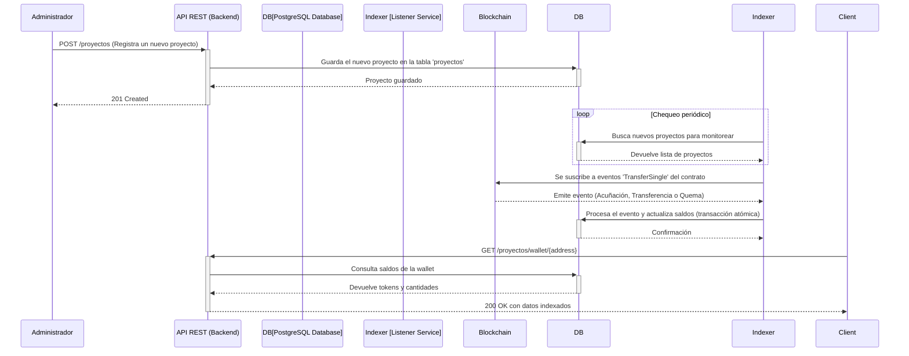

# Sustainable Credits Indexer (Backend)

**Desarrollado por: Rubén Guerrero (Backend)**

---

## 1. Resumen del Proyecto

Este proyecto es un servicio de **indexación backend**, construido con **NestJS**, diseñado para monitorear, procesar y registrar transacciones de créditos de sostenibilidad (carbono, biodiversidad, etc.) desde una blockchain compatible con EVM hacia una base de datos PostgreSQL.

El servicio escucha activamente los eventos de contratos inteligentes (estándar ERC-1155) que representan **Activos del Mundo Real (RWA)**. Procesa estos eventos en tiempo real y los persiste en la base de datos, creando una fuente de datos rápida, fiable y consultable.

El objetivo principal es desacoplar a las aplicaciones cliente de la interacción directa con la blockchain para consultas de estado (como saldos de tokens), lo cual sería lento y costoso. Además, expone una API RESTful segura para la gestión dinámica de los proyectos a indexar.

## 2. Arquitectura y Flujo de Datos

El siguiente diagrama ilustra el flujo de información desde la blockchain hasta el cliente final, destacando la interacción entre los componentes clave del sistema.



### Componentes Clave:

- **NestJS:** Framework progresivo de Node.js para construir un backend robusto y escalable.
- **TypeORM:** Un ORM para TypeScript que facilita una interacción segura y tipada con la base de datos, incluyendo migraciones y transacciones.
- **PostgreSQL:** Base de datos relacional para almacenar el estado indexado de los proyectos y los saldos de tokens.
- **Ethers.js:** Librería para interactuar con la blockchain, permitiendo la conexión a nodos RPC y la decodificación de eventos de contratos.

## 3. Características Principales

- **Indexación en Tiempo Real:** Utiliza WebSockets para conectarse a un nodo RPC y escuchar eventos de contratos tan pronto como se emiten, garantizando que la base de datos esté siempre actualizada.
- **Gestión Dinámica de Proyectos:** Expone una API RESTful para que un administrador pueda registrar, actualizar o eliminar proyectos dinámicamente sin necesidad de reiniciar el servidor.
- **Manejo de ABIs por Archivo:** En lugar de enviar ABIs complejos en el cuerpo de una petición, la API carga los ABIs desde archivos `.json` locales (`src/abis`), haciendo la gestión más limpia, segura y mantenible.
- **Operaciones Atómicas:** Todas las actualizaciones en la base de datos (acuñaciones, transferencias) se envuelven en **transacciones**. Esto garantiza la integridad de los datos: o todas las operaciones se completan con éxito, o ninguna lo hace.
- **Manejo Integral de ERC-1155:** Interpreta correctamente el evento `TransferSingle` para diferenciar entre:
  - **Acuñación (Mint):** `from` es la dirección cero (`0x00...`).
  - **Transferencia (Transfer):** `from` y `to` son billeteras válidas.
  - **Quema (Burn):** `to` es la dirección cero (`0x00...`).

## 4. Seguridad

La API implementa un mecanismo de autenticación basado en **Clave de API (API Key)** para proteger los endpoints de gestión.

- **Endpoints Protegidos:** `POST /proyectos`, `PATCH /proyectos/:id`, `DELETE /proyectos/:id`.
- **Mecanismo:** Las peticiones a estos endpoints deben incluir una cabecera `x-api-key` con un valor secreto.
- **Guardia de Seguridad (`ApiKeyGuard`):** Un `Guard` de NestJS intercepta las peticiones a rutas protegidas y valida la clave de API contra la que está almacenada de forma segura en las variables de entorno (`.env`).
- **Endpoints Públicos:** Las rutas de consulta (`GET`) permanecen abiertas para permitir el acceso público a los datos indexados.

## 5. Configuración del Entorno

1.  Navega a la carpeta del backend: `cd sustainable-credits-indexer`.
2.  Crea un archivo `.env` en la raíz de esta carpeta con las siguientes variables:

    ```env
    # Configuración de la Base de Datos PostgreSQL
    DB_HOST=localhost
    DB_PORT=5432
    DB_USERNAME=postgres
    DB_PASSWORD=mysecretpassword
    DB_DATABASE=credits_indexer

    # Configuración de la Blockchain
    JSON_RPC_URL="https://testnet-passet-hub-eth-rpc.polkadot.io"

    # Clave de API para proteger los endpoints de administración
    API_KEY="tu-clave-secreta-muy-dificil-de-adivinar"
    ```

3.  Instala las dependencias: `npm install`.
4.  Ejecuta las migraciones de la base de datos (si aplica): `npm run typeorm:run`.
5.  Inicia el servidor en modo de desarrollo: `npm run start:dev`.

#### Detalles de la Red del Hackathon (Paseo Testnet)

Para configurar wallets como MetaMask o para interactuar con la red, utiliza los siguientes detalles:

- **Network Name:** Polkadot Hub TestNet
- **Chain ID:** 420420422
- **RPC URL:** https://testnet-passet-hub-eth-rpc.polkadot.io
- **Block Explorer:** https://blockscout-passet-hub.parity-testnet.parity.io
- **Faucet:** https://faucet.polkadot.io/?parachain=1111

## 6. API Endpoints

El indexador expone una API RESTful para gestionar los proyectos y consultar los datos.

### Gestión de Proyectos (CRUD - Protegido)

> **Nota:** Todas estas peticiones requieren la cabecera `x-api-key: <tu-clave-secreta>`.

- **`POST /proyectos`**: Registra un nuevo proyecto para ser indexado.
  - **Cuerpo de la Petición:**
    ```json
    {
      "nombre": "Proyecto de Conservación Marina",
      "tipoCredito": "BIODIVERSIDAD",
      "fechaVerificacion": "2023-11-15T00:00:00.000Z",
      "cantidadAcunada": 0,
      "contractAddress": "0x1234567890123456789012345678901234567890",
      "abiName": "erc1155-base",
      "ipfsHashDocumentos": "QmY...Z"
    }
    ```
- **`PATCH /proyectos/:id`**: Actualiza la información de un proyecto existente.
- **`DELETE /proyectos/:id`**: Elimina un proyecto. El `ListenerService` dejará de monitorearlo.

### Consulta de Datos (Público)

- **`GET /proyectos/wallet/:address`**: Obtiene todos los tokens de crédito que posee una billetera específica.
  - **Ejemplo de Respuesta:**
    ```json
    [
      {
        "id": "a1b2c3d4-...",
        "tokenId": 1,
        "ownerWallet": "0x...",
        "cantidad": "150.00",
        "proyecto": {
          "id": "e5f6g7h8-...",
          "nombre": "Proyecto de Reforestación Amazónica",
          "tipoCredito": "CARBONO"
        }
      }
    ]
    ```

## 7. Estructura de la Base de Datos

El servicio utiliza dos entidades principales que se mapean a tablas en PostgreSQL.

#### `Proyecto`

Almacena la información de cada proyecto de sostenibilidad que se va a indexar.

- `id`: UUID (Clave primaria).
- `nombre`: Nombre del proyecto.
- `tipoCredito`: Enum (`CARBONO`, `BIODIVERSIDAD`, `RECICLAJE`).
- `contractAddress`: **Clave.** La dirección del contrato inteligente.
- `abi`: El ABI del contrato en formato `jsonb`. Esto permite que cada proyecto tenga un contrato diferente y se carga dinámicamente desde un archivo.
- `ipfsHashDocumentos`: Hash de IPFS que apunta a la documentación de verificación del proyecto.

#### `CreditoToken`

Representa la posesión de tokens por parte de una billetera. Esta tabla es el resultado directo de la indexación de eventos.

- `id`: UUID (Clave primaria).
- `tokenId`: El ID del token dentro del contrato ERC-1155.
- `ownerWallet`: La dirección de la billetera propietaria.
- `cantidad`: La cantidad de créditos que posee.
- `proyecto`: Relación `ManyToOne` con la entidad `Proyecto`.

---

## 8. Documentación Interactiva de la API (Swagger)

Este proyecto incluye una documentación de API interactiva generada con Swagger (OpenAPI). Una vez que el servidor esté en funcionamiento, puedes acceder a ella desde tu navegador.

- **URL:** http://localhost:3000/api-docs

Desde esta interfaz, puedes ver todos los endpoints, sus parámetros, los esquemas de datos y probar las peticiones directamente. Para los endpoints protegidos, haz clic en el botón "Authorize" e introduce tu `API_KEY` para autenticar tus peticiones.
